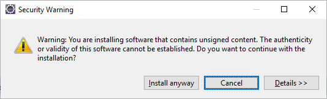

# Preparazione ambiente di sviluppo

Di seguito la spiegazione di come configurare l'ambiente di sviluppo

# Java

Scaricare java jdk versione "jdk1.8.0_171" ed installarla.

Aggiungere ai percorsi presenti nella variabile di ambiente PATH il percorso di installazione

"C:\Program Files\Java\jdk1.8.0_171\bin"

e creare variabile di ambiente di sistema 

JAVA_HOME=C:\Program Files\Java\jdk1.8.0_171

# Postgres

* scaricare Postgres 10.3 per windows
* installarlo
* scaricare il driver postgresql-42.2.2.jar ( https://jdbc.postgresql.org/download.html#others - colonna JDBC 4.2 )
* installare un query manager tipo pgadmin oppure Dbeaver
* creare il database FurmaxTemplate con user FurmaxTemplate e password FurmaxTemplate
 
# Git

* Scaricare Git da https://git-scm.com/download/win  ( 64-bit Git for Windows Setup )
  * eseguire l'installazione lasciando tutte le opzione di default

* Da linea di comando, posizionarsi sulla cartella nella quale si vuole scaricare il repository e digitare

git clone https://github.com/ilmagowalter/FurmaxTemplate.git

# Eclipse

* Scaricare da https://www.eclipse.org/downloads/ "Eclipse IDE 2020‑03"
* Lanciare l'installer e selezionare "Eclipse ODE for Enterprise Kava Developers"
* Aprire il file eclipse.ini che si trova nella cartella di installazione di eclipse e sostituire ed impostare i seguenti valori al posto di quelli esistenti:
  * -Xms1024m
  * -Xmx2048m
* Avviare eclipse, creare un nuovo workspace
* Passare alla prospettiva Java


* sotto windows -> preferences -> validation, disabilitare tutti i validatori dalla colonna build


* sotto windows -> preferences -> Spelling, disabilitare lo spell checking


* sotto windows -> preferences -> Save Actions, abilitare le save action e verificare che il formatter sia "Eclipse built-in"


* aggiungere la view server


* e verificare che si veda il pannello:


* creare un nuovo server ( attendere che venga aggiornata la lista degli adapter, l'avanzamento in basso a dx ):




selezionare install anyway


selezionare restart now


* dopo aver riavviato eclipse, selezionare “NO”:

* creare un nuovo server:


selezionare Wildfly 17


* cliccare su download and install runtime

* Selezionare la cartella dove installare e configurare Wildfly


* attendere il download...

* selezionare alternate JRE, cliccare su Installed JREs, poi add, standard vm, directory


* cliccare su finish
* avviare wildfly verificando nella console che parta correttamente
* stoppare Wildfly

* eseguire [Configurazione Wildfly 17](#Wildfly)


* importare il progetto su eclipse come existing gradle project

* cliccare su Wildfly 17 -> add and remove, e aggiungere FlowManager2

# Wildfly

* aggiungere alla variabile di ambiente PATH il percorso di installazione di Wildfly ( D:\Workspace\AppServer\wildfly-17.0.1.Final\bin )
* avviare Wildfly ( anche da eclipse )
* da browser verificare che wildfly risponda correttamente all’url di default: http://localhost:9990
* stoppare Wildfly
* da linea di comando andare nella cartella di installazione Wildfy/bin ( es. D:\Workspace\AppServer\wildfly-17.0.1.Final\bin )
* tramite add-user.bat aggiungere l’utente di admin con password **furmax2020**


* avviare wildfly e andare su http://localhost:9990/ accedere con l’utente admin e la password fornita al passaggio precedente

* andare da linea di comando nel percorso del pc dove è salvato il file postgresql-42.2.2.jar ( es. desktop )
* avviare jboss-cli ( wildfly deve essere attivo )
* eseguire i seguenti comandi
    
```
connect

module add --name=org.postgresql.Driver --resources=postgresql-42.2.2.jar --dependencies=javax.api,javax.transaction.api

/subsystem=datasources/jdbc-driver=postgres:add(driver-name="postgres",driver-module-name="org.postgresql.Driver",driver-class-name=org.postgresql.Driver)

data-source add --jndi-name=java:/PostgresDS --name=PostgresDS --connection-url=jdbc:postgresql://localhost:5432/furmaxtemplate --driver-name=postgres --user-name=furmaxTemplate –password=furmaxtemplate

```

da Console di amministrazione di wildfly verificare che la connessione sia attiva tramite il test connection


entrare nel datasource e nella tab Validation inserire le seguenti classi come da immagine 

```
select 1

org.jboss.jca.adapters.jdbc.extensions.postgres.PostgreSQLValidConnectionChecker

org.jboss.jca.adapters.jdbc.extensions.postgres.PostgreSQLExceptionSorter
```


## configurazione token authentication

* da linea di comando andare nella cartella di installazione Wildfy/standalone/configuration ( es. D:\Workspace\AppServer\wildfly-17.0.1.Final\standalone\configuration )
* eseguire i seguenti comandi

```
keytool -genkey -alias alias -keyalg RSA -keysize 2048 -keystore chiave.jwt.keystore -storepass secret -keypass secret

```

* migrare la chiave al nuovo formato:

```
keytool -importkeystore -srckeystore chiave.jwt.keystore -destkeystore chiave.jwt.keystore -deststoretype pkcs12

```

* collegarsi con jboss-cli ed eseguire 

```
/subsystem=elytron/key-store=jwt-key-store:add(type="JKS",relative-to=jboss.server.config.dir,path="chiave.jwt.keystore",credential-reference={clear-text="secret"})

/subsystem=elytron/token-realm=jwt-realm:add(jwt={issuer=["chiave-jwt-issuer"],audience=["jwt-audience"],key-store=jwt-key-store,certificate="alias"},principal-claim="sub")

/subsystem=elytron/security-domain=jwt-domain:add(realms=[{realm=jwt-realm,role-decoder=groups-to-roles}],permission-mapper=default-permission-mapper,default-realm=jwt-realm)

/subsystem=elytron/http-authentication-factory=jwt-http-authentication:add(security-domain=jwt-domain,http-server-mechanism-factory=global,mechanism-configurations=[{mechanism-name="BEARER_TOKEN",mechanism-realm-configurations=[{realm-name="jwt-realm"}]}])

/subsystem=undertow/application-security-domain=other:add(http-authentication-factory=jwt-http-authentication)

reload
```

Settare la persistence per il batch in http://localhost:9990: Configuration -> SubSystems -> Batch -> View -> JDBC -> Add (Name: jobpersistence, PostgresDS in autocompletamento)

e configurare il subsystem per la persistenza creata:

